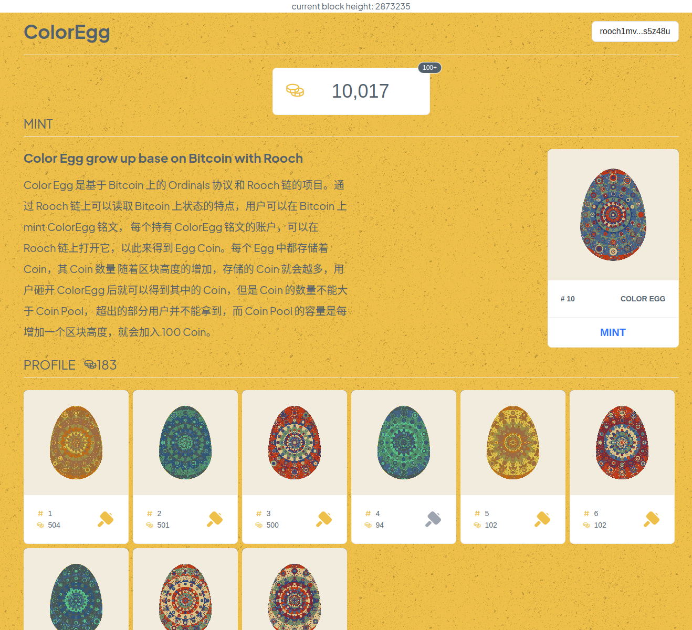

# ColorEgg
- 项目名称
  - ColorEgg(彩蛋)
- 项目描述
  - Color Egg 是基于 Bitcoin 上的 Ordinals 协议 和 Rooch 链的项目。通过 Rooch 链上可以读取
    Bitcoin 上状态的特点，用户可以在 Bitcoin 上 mint ColorEgg 铭文， 每个持有 ColorEgg 铭文的账户，
    可以在 Rooch 链上打开它，以此来得到 Egg Coin。每个 Egg 中都存储着 Coin，其 Coin 数量 随着区块高度的增加，
    存储的 Coin 就会越多，用户砸开 ColorEgg 后就可以得到其中的 Coin，但是 Coin 的数量不能大于 Coin Pool，
    超出的部分用户并不能拿到，而 Coin Pool 的容量是每增加一个区块高度，就会加入 100 Coin。
- Github
  - https://github.com/TheHeBoy/ColorEgg
- 成员： 
  - Anchor(全栈工程师)，RKStone(算法艺术家)
- 附加材料： 
  - 